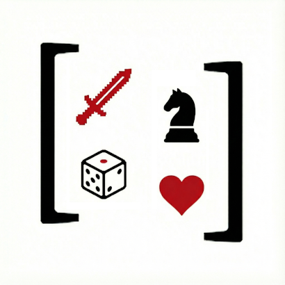

# BoardGamePy

<p align="center">
  
</p>

A lean Python framework for building AI-playable board games with reusable abstractions.

**📚 [Complete Documentation](docs/)** | **🚀 [Getting Started Tutorial](docs/getting-started.md)** | **⚡ [Quick Start](QUICKSTART.md)**

## Overview

BoardGamePy provides core abstractions for creating board games that can be played by AI agents (using LLMs) or human players. It was extracted from a Codenames implementation and designed to be extended for other turn-based board games like Chess, Splendor, Sushi Go, and more.

## Key Features

- **Role-based information hiding** - Built-in support for games where different players see different information
- **AI integration** - First-class support for LLM-powered agents with automatic prompt generation
- **Action history tracking** - Automatic logging of all actions for replay, debugging, and AI context
- **Human/AI hybrid play** - Mix human and AI players in the same game
- **Declarative API** - Define games by subclassing base classes, similar to Django models or Pydantic

## Installation

### From GitHub Release (Recommended)

Download the latest release from [GitHub Releases](https://github.com/fathiyul/boardgamepy/releases):

```bash
# Download and install the wheel file
pip install https://github.com/fathiyul/boardgamepy/releases/download/v0.1.0/boardgamepy-0.1.0-py3-none-any.whl

# With AI support (for LLM agents)
pip install https://github.com/fathiyul/boardgamepy/releases/download/v0.1.0/boardgamepy-0.1.0-py3-none-any.whl[ai]

# With all optional dependencies
pip install https://github.com/fathiyul/boardgamepy/releases/download/v0.1.0/boardgamepy-0.1.0-py3-none-any.whl[ai,examples]
```

Or download the `.whl` file manually and install:

```bash
pip install boardgamepy-0.1.0-py3-none-any.whl
```

### From Source (for development)

```bash
# Clone the repository
git clone https://github.com/fathiyul/boardgamepy.git
cd boardgamepy

# Install in editable mode
pip install -e .

# With AI support (for LLM agents)
pip install -e ".[ai]"

# For running examples
pip install -e ".[ai,examples]"
```

> **Note**: BoardGamePy is not yet published to PyPI. Use GitHub releases or install from source.

## Quick Start

### Defining a Game

```python
from boardgamepy import Game, GameState, Action, Board, Player

class MyGameState(GameState):
    current_player: int = 0

    def is_terminal(self) -> bool:
        return False  # Implement win condition

    def get_winner(self):
        return None  # Return winner when terminal


class MyGame(Game):
    name = "My Game"
    min_players = 2
    max_players = 4

    def setup(self, **config):
        self.state = MyGameState()
        self.board = MyBoard()
        self.players = [Player(team="1"), Player(team="2")]

    def get_current_player(self):
        return self.players[self.state.current_player]

    def next_turn(self):
        self.state.current_player = (self.state.current_player + 1) % len(self.players)
```

### Defining Actions

```python
from boardgamepy import Action
from pydantic import BaseModel, Field

class MoveOutput(BaseModel):
    """LLM output schema for moves."""
    position: int = Field(..., description="Position to move to")
    reasoning: str | None = None

class MoveAction(Action["MyGame"]):
    name = "move"
    display_name = "Move Piece"
    OutputSchema = MoveOutput  # For AI structured output

    def validate(self, game, player, position: int) -> bool:
        return 0 <= position < 10  # Example validation

    def apply(self, game, player, position: int):
        # Update game state
        game.history.add_action(self, player, position=position)

    def to_history_record(self, player, position: int, **params):
        return {"type": "move", "player": player.name, "position": position}
```

### Running a Game

```python
game = MyGame()
game.setup()

# Game loop (simplified)
while not game.state.is_terminal():
    player = game.get_current_player()
    action, params = player.agent.decide(game, player)
    if action.validate(game, player, **params):
        action.apply(game, player, **params)

winner = game.state.get_winner()
```

## Logging & Fine-Tuning

BoardGamePy includes a comprehensive MongoDB-based logging system that captures:
- Every game action and state transition
- Full LLM prompts and responses
- AI reasoning for each decision
- Game metadata and outcomes

### Enable Logging

#### Option 1: Local MongoDB

1. **Start MongoDB:**
```bash
docker run -d -p 27017:27017 --name mongodb mongo:latest
```

2. **Configure (edit `.env`):**
```env
# MongoDB Configuration
MONGO_URI=mongodb://localhost:27017
MONGO_DB_NAME=boardgamepy_logs

# Logging Configuration
ENABLE_LOGGING=true
LOG_LEVEL=INFO

# LLM Model Defaults
OPENAI_MODEL=gpt-4o-mini
OPENROUTER_MODEL=google/gemini-2.5-flash

# API Keys
OPENAI_API_KEY=your-openai-api-key-here
OPENROUTER_API_KEY=your-openrouter-api-key-here

# LangSmith Tracing
LANGCHAIN_TRACING_V2=true
LANGCHAIN_API_KEY=your-langsmith-api-key-here
LANGCHAIN_PROJECT=boardgamepy
LANGCHAIN_ENDPOINT=https://api.smith.langchain.com
```

3. **Run a game** - logging happens automatically!

#### Option 2: MongoDB Atlas (Cloud)

1. **Create MongoDB Atlas cluster:**
   - Sign up at [mongodb.com/cloud/atlas](https://www.mongodb.com/cloud/atlas)
   - Create a free cluster
   - Go to "Database Access" and create a database user
   - Go to "Network Access" and add your IP address (or use 0.0.0.0/0 for testing)

2. **Get connection string:**
   - Click "Connect" on your cluster
   - Choose "Connect your application"
   - Copy the connection string (looks like `mongodb+srv://...`)

3. **Configure (edit `.env`):**
```env
ENABLE_LOGGING=true
MONGO_URI=mongodb+srv://<username>:<password>@<cluster>.mongodb.net/?retryWrites=true&w=majority
MONGO_DB_NAME=boardgamepy_logs

# Optional: Enable LangSmith for LLM observability
LANGCHAIN_TRACING_V2=true
LANGCHAIN_API_KEY=your-langsmith-api-key
LANGCHAIN_PROJECT=boardgamepy
```

Replace `<username>`, `<password>`, and `<cluster>` with your actual MongoDB Atlas credentials.

**Important:** If your password contains special characters (`#!%@$&+,/:;=?@[]`), you need to URL-encode it:
```bash
python3 -c "import urllib.parse; print(urllib.parse.quote_plus('your-password'))"
```
Use the encoded password in your `MONGO_URI`.

4. **Run a game** - logging happens automatically!

### LangSmith Integration (Optional)

BoardGamePy automatically integrates with [LangSmith](https://smith.langchain.com/) for LLM observability. When enabled, all LLM calls are automatically traced to the LangSmith dashboard with no code changes needed. Monitor prompts, responses, token usage, and latency in real-time.

### View Logged Games

```bash
# List recent games (shows numbered index)
python view_logs.py list

# List specific game type (last 5 games)
python view_logs.py list TicTacToe 5

# Show detailed game information (use index from list or game_id)
python view_logs.py details 1           # Latest game by index
python view_logs.py details <game-id>   # Specific game by ID

# Show statistics
python view_logs.py stats
python view_logs.py stats Codenames

# Export for fine-tuning (creates training_data.json)
python view_logs.py export TicTacToe 1000
```

See [LOGGING_GUIDE.md](LOGGING_GUIDE.md) for complete documentation.

## Examples

All 12 included game examples have full MongoDB and LangSmith logging support. See `examples/README.md` for detailed information.

### Codenames

A complete Codenames implementation is included in `examples/codenames/` demonstrating:

- Role-based views (Spymaster sees card types, Operatives don't)
- Multiple action types (ClueAction, GuessAction, PassAction)
- AI prompt generation for different roles
- LLM agent configuration

```bash
cd examples/codenames
python main.py
```

### All Available Examples

- **TicTacToe** - Classic 3x3 grid game
- **Codenames** - Team-based word association game
- **Love Letter** - Card game with bluffing and deduction
- **Sushi Go** - Card drafting game with simultaneous decisions
- **Wavelength** - Cooperative guessing game with spectrum
- **Splendor** - Engine-building card game
- **Coup** - Bluffing and character-based game
- **Incan Gold** - Push-your-luck temple exploration
- **Subtract-a-Square** - Mathematical subtraction game
- **Nim** - Classic pile subtraction game
- **Wythoff** - Two-pile Nim variant
- **More examples coming soon!**

## Architecture

### Core Abstractions

- **Game** - Central class coordinating all components
- **GameState** - Current game state (scores, whose turn, etc.)
- **Action** - Things players can do (validate, apply, log)
- **Board** - Game board with role-based views
- **Player** - Player with team, role, and agent
- **GameHistory** - Action history for replay and AI context

### AI Integration

- **PromptBuilder** - Constructs LLM prompts from game state
- **LLMAgent** - Agent powered by language models
- **ActionOutput** - Pydantic schemas for structured LLM responses

### Information Hiding

The framework enforces role-based information hiding through `Board.get_view(context)`:

```python
class CodenamesBoard(Board):
    def get_view(self, context: ViewContext) -> str:
        if context.player.role == "Spymaster":
            return self._spymaster_view()  # Shows card types
        return self._operatives_view()  # Hides card types
```

## Project Structure

```
boardgamepy/
├── core/           # Core game abstractions
│   ├── player.py   # Player and agents
│   ├── state.py    # GameState
│   ├── action.py   # Action system
│   ├── history.py  # Action logging
│   └── game.py     # Game base class
├── components/     # Board and piece abstractions
├── ai/             # AI integration
│   ├── prompt.py   # Prompt building
│   └── agent.py    # LLM agents
└── ui/             # UI rendering

examples/codenames/ # Reference implementation
```

## Design Principles

1. **Lean and focused** - Core abstractions only, no over-engineering
2. **Declarative** - Games defined as classes with clear metadata
3. **Type-safe** - Uses Generics and Protocols for flexibility
4. **AI-first** - Prompt generation and structured outputs built-in
5. **Extensible** - Clear extension points for new games

## Creating Your Own Game

To create a new game using boardgamepy:

1. **Define game state** - Extend `GameState` with game-specific fields
2. **Define board** - Extend `Board` with role-based views
3. **Define actions** - Create `Action` subclasses with validation and application logic
4. **Define prompts** - Create `PromptBuilder` subclasses for each role (if using AI)
5. **Tie it together** - Create `Game` subclass that coordinates everything

See `examples/codenames/` for a complete reference implementation.

## Dependencies

**Core:**
- Python >=3.10
- pydantic >=2.0
- typing-extensions >=4.0

**AI (optional):**
- langchain-core >=0.1
- langchain-openai >=0.1

## License

MIT

## Contributing

This is a framework extracted from a Codenames implementation. Contributions welcome for:
- Additional game examples (Chess, Splendor, etc.)
- Documentation improvements
- Bug fixes and optimizations
- UI renderers (web, mobile, etc.)

